# SubMagic Avatar POC

AI-powered talking avatar video generator. Enter a script, pick an avatar and caption style — the pipeline produces a lip-synced, captioned MP4 in minutes.

---

## System Architecture

The pipeline supports three interchangeable **lip-sync backends**. Everything else (script enhancement, transcription, captions, final render) stays the same.

---

## Architecture 1 — Tavus (Cloud API) ✅ Current


### Tavus Data Flow

| Step | Service | Input | Output | Time |
|------|---------|-------|--------|------|
| 1 | Gemini 2.5 Flash | Raw script + emotion | Enhanced script | ~2s |
| 2–3 | Tavus API | Replica ID + script | Talking head MP4 | ~1–3 min |
| 4 | FFmpeg + Groq Whisper | MP4 | Word timestamps | ~10s |
| 5 | FFmpeg | Video + .ass | Captioned MP4 | ~15s |

**Tavus handles both voice synthesis and face animation in one API call.** No local GPU required.

---

## Architecture 2 — SadTalker (Local, Free)


### SadTalker Data Flow

| Step | Service | Input | Output | Time |
|------|---------|-------|--------|------|
| 1 | Gemini 2.5 Flash | Raw script + emotion | Enhanced script | ~2s |
| 2 | macOS TTS (`say`) + FFmpeg | Script text | speech.mp3 | ~3s |
| 3 | SadTalker (Python/MPS) | Portrait image + audio | Silent MP4 | ~3–5 min |
| 4 | FFmpeg mux | MP4 + MP3 | MP4 with audio | ~2s |
| 5 | FFmpeg + Groq Whisper | MP4 | Word timestamps | ~10s |
| 6 | FFmpeg | Video + .ass | Captioned MP4 | ~15s |

**Runs entirely on-device.** No API costs — requires local Python venv + model weights (~4 GB).

---

## Architecture 3 — LivePortrait (Local, Free)


### LivePortrait Data Flow

| Step | Service | Input | Output | Time |
|------|---------|-------|--------|------|
| 1 | Gemini 2.5 Flash | Raw script + emotion | Enhanced script | ~2s |
| 2 | macOS TTS + FFmpeg | Script text | speech.mp3 | ~3s |
| 3 | LivePortrait (Python/MPS) | Portrait image + driving video | Animated MP4 | ~2–4 min |
| 4 | FFmpeg mux | MP4 + MP3 | MP4 with audio | ~2s |
| 5 | FFmpeg + Groq Whisper | MP4 | Word timestamps | ~10s |
| 6 | FFmpeg | Video + .ass | Captioned MP4 | ~15s |

**More natural head motion than SadTalker** (full face stitching), but requires a reference driving video for expressions.

---

## Side-by-Side Comparison

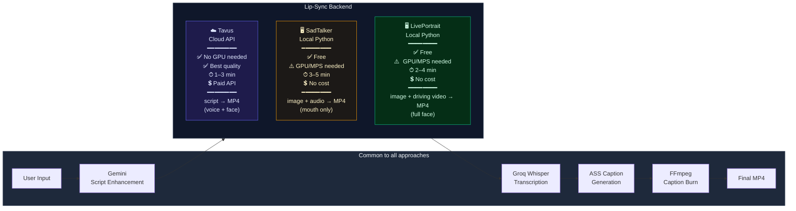

---

---

## Platform Comparison — Avatar Video Generation

A full survey of every viable platform for generating talking-avatar videos, from cloud APIs to open-source local models.

---

### Category Map

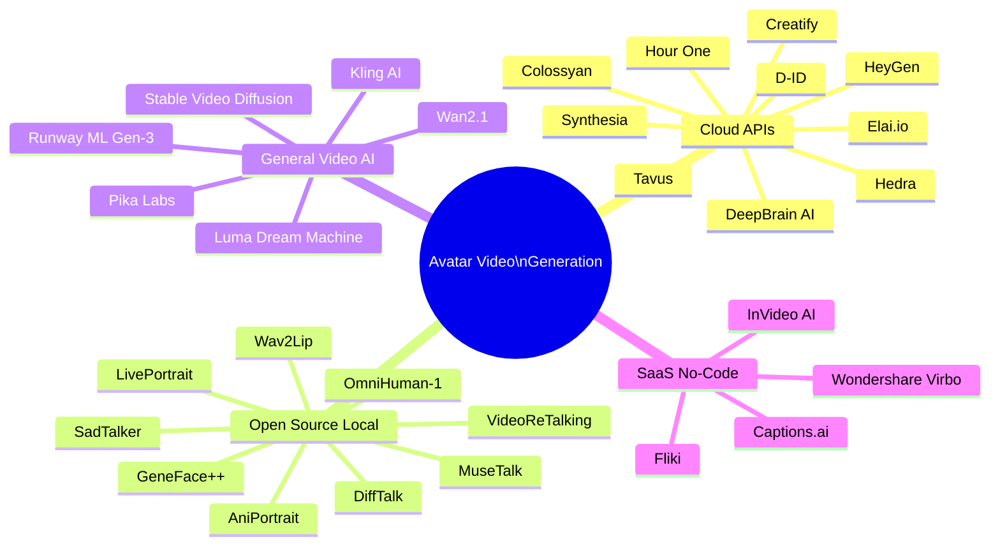

---

### 1. Cloud API Platforms

#### Quick Comparison Table

| Platform | Avatar Type | Voice Included | API | Lip Sync | Head Motion | Render Time | Free Tier | Pricing |
|----------|------------|---------------|-----|----------|-------------|-------------|-----------|---------|
| **Tavus** ✅ | Stock + Custom replica | ✅ Replica voice | ✅ REST | ⭐⭐⭐⭐⭐ | Head + shoulders | 1–3 min | ❌ | ~$0.05/min |
| **D-ID** | Stock + Photo | ✅ TTS or custom | ✅ REST | ⭐⭐⭐⭐ | Head only | 30–90s | ✅ 5 videos/mo | $5.9/mo |
| **HeyGen** | Stock + Instant + Photo | ✅ Voice clone | ✅ REST | ⭐⭐⭐⭐⭐ | Head + gestures | 1–2 min | ✅ 1 min/mo | $29/mo |
| **Synthesia** | 230+ stock + Personal | ✅ 140 voices | ✅ REST | ⭐⭐⭐⭐⭐ | Head + upper body | 2–5 min | ❌ | $29/mo |
| **DeepBrain AI** | Stock + Custom | ✅ TTS | ✅ REST | ⭐⭐⭐⭐ | Head + body | 2–4 min | ❌ | $30/mo |
| **Hour One** | 100+ stock + Custom | ✅ TTS | ✅ REST | ⭐⭐⭐⭐ | Head + upper body | 3–5 min | ❌ | $25/mo |
| **Colossyan** | 150+ stock + Custom | ✅ TTS + clone | ✅ REST | ⭐⭐⭐⭐ | Head + body | 2–4 min | ✅ 5 min/mo | $28/mo |
| **Elai.io** | 80+ stock + Photo | ✅ TTS + clone | ✅ REST | ⭐⭐⭐⭐ | Head | 1–3 min | ✅ 1 min/mo | $29/mo |
| **Hedra** | Photo | ✅ Upload audio | ✅ REST | ⭐⭐⭐⭐ | Head | 30–90s | ✅ 3 min/mo | $8/mo |
| **Creatify** | 500+ stock + Digital Twin | ✅ Voice clone | ✅ REST | ⭐⭐⭐⭐⭐ | Head + upper body | 1–2 min | ✅ Trial | $39/mo |

---

#### Tavus

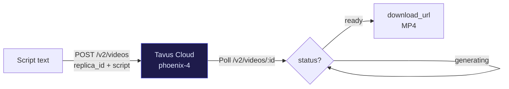

| Property | Detail |
|----------|--------|
| **Model** | Phoenix 2 / 3 / 4 |
| **Input** | `replica_id` (pre-trained from video) + script text |
| **Output** | Full MP4 with replica's voice + animated face |
| **Voice** | Cloned from replica training video — no separate TTS needed |
| **Head motion** | Realistic head/shoulder movement, natural blinks |
| **Lip sync accuracy** | Excellent — trained end-to-end on the person |
| **Resolution** | Up to 1080p |
| **API auth** | `x-api-key` header |
| **Async** | Yes — submit job, poll for completion |
| **Replica creation** | One-time upload of a 2-min consent video |
| **Best for** | Consistent brand avatars, high-quality personalization |
| **Limitation** | Replica creation takes ~24h; paid only |

---

#### D-ID

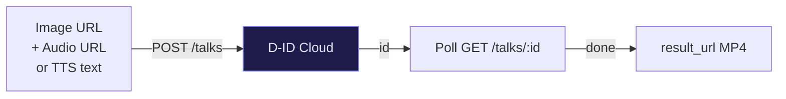

| Property | Detail |
|----------|--------|
| **Model** | Latent Diffusion + GAN-based |
| **Input** | Portrait image + audio file OR text (built-in TTS) |
| **Output** | Talking head MP4 |
| **Voice** | 50+ built-in TTS voices or upload custom audio |
| **Head motion** | Subtle head nod + mouth sync only |
| **Lip sync accuracy** | Good — audio-driven |
| **Resolution** | Up to 1080p |
| **API auth** | Basic auth (email:key) |
| **Async** | Yes — poll for result |
| **Best for** | Quick prototypes from any portrait photo |
| **Limitation** | Head motion less natural than Tavus/HeyGen; body stays still |

---

#### HeyGen

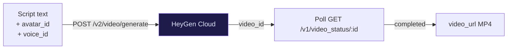

| Property | Detail |
|----------|--------|
| **Model** | Proprietary (best-in-class quality) |
| **Input** | Avatar ID + voice ID + script |
| **Output** | Full video with gestures |
| **Voice** | Voice clone (30s sample) or 300+ built-in voices |
| **Head motion** | Head, shoulders, hand gestures |
| **Lip sync accuracy** | Excellent |
| **Resolution** | Up to 4K |
| **API auth** | Bearer token |
| **Async** | Yes |
| **Instant Avatar** | Upload 2-min video → usable in minutes |
| **Best for** | Marketing/sales videos, highest production quality |
| **Limitation** | Most expensive; rate limits on free tier |

---

#### Synthesia

| Property | Detail |
|----------|--------|
| **Model** | Proprietary enterprise |
| **Input** | Script text + avatar selection |
| **Output** | Video with full upper-body presenter |
| **Voice** | 140+ languages, voice clone available |
| **Head motion** | Full upper-body with natural gestures |
| **Lip sync accuracy** | Excellent |
| **Resolution** | 1080p |
| **API** | REST API (Enterprise plan only) |
| **Best for** | Corporate training, e-learning, localization |
| **Limitation** | API only on Enterprise ($$$); no custom audio upload on lower tiers |

---

#### Hedra

| Property | Detail |
|----------|--------|
| **Model** | Character-1 (audio-reactive) |
| **Input** | Portrait image + audio file |
| **Output** | Talking head MP4 |
| **Voice** | Upload your own audio — no built-in TTS |
| **Head motion** | Head nod + expression changes |
| **Lip sync accuracy** | Very good |
| **Resolution** | Up to 1080p |
| **API** | REST API (Beta) |
| **Best for** | Custom voice + photo combo; budget option |
| **Limitation** | Audio must be pre-generated; newer/less stable API |

---

#### Creatify

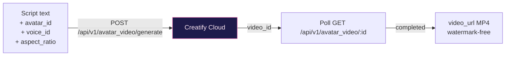

| Property | Detail |
|----------|--------|
| **Model** | Proprietary (ad-optimised) |
| **Input** | Avatar ID + voice ID + script text + aspect ratio |
| **Output** | Full upper-body talking avatar MP4 |
| **Voice** | Voice clone (upload sample) or 200+ built-in voices |
| **Head motion** | Upper body with natural gestures — optimised for short-form ads |
| **Lip sync accuracy** | Excellent |
| **Resolution** | Up to 1080p, supports 9:16 / 1:1 / 16:9 |
| **API auth** | `Authorization: Bearer` token |
| **Async** | Yes — poll for completion |
| **Avatar library** | 500+ stock digital humans + "Digital Twin" from 2-min video |
| **Unique feature** | URL-to-video (paste a product URL → auto-generates ad script + video) |
| **Best for** | Performance marketing, short-form ad creatives, TikTok/Reels/YouTube Shorts |
| **Limitation** | Focused on ads/short content; less suited for long-form or educational video |

---

### 2. Open-Source Local Models

#### Quick Comparison Table

| Model | Input | Head Motion | Quality | GPU RAM | Speed (CPU/MPS) | Speed (CUDA) | Voices Included |
|-------|-------|-------------|---------|---------|-----------------|--------------|----------------|
| **SadTalker** | Portrait + audio | Mouth + head | ⭐⭐⭐⭐ | 4 GB | 3–5 min | 30–60s | ❌ |
| **LivePortrait** | Portrait + driving video | Full face | ⭐⭐⭐⭐⭐ | 6 GB | 2–4 min | 20–40s | ❌ |
| **Wav2Lip** | Face video + audio | Mouth only | ⭐⭐⭐ | 2 GB | 1–2 min | 15–30s | ❌ |
| **MuseTalk** | Portrait + audio | Mouth + head | ⭐⭐⭐⭐ | 8 GB | 2–3 min | 10–20s | ❌ |
| **VideoReTalking** | Face video + audio | Mouth only | ⭐⭐⭐⭐ | 4 GB | 2–4 min | 20–40s | ❌ |
| **DiffTalk** | Portrait + audio | Mouth + head | ⭐⭐⭐⭐ | 8 GB | 5–10 min | 1–2 min | ❌ |
| **GeneFace++** | Portrait + audio | Full head | ⭐⭐⭐⭐⭐ | 8 GB | ❌ (CUDA only) | 1–2 min | ❌ |
| **AniPortrait** | Portrait + audio | Full head | ⭐⭐⭐⭐ | 16 GB | ❌ (CUDA only) | 2–4 min | ❌ |
| **OmniHuman-1** | Portrait + audio/video | Full body | ⭐⭐⭐⭐⭐ | 24 GB | ❌ (CUDA only) | 3–6 min | ❌ |

---

#### SadTalker

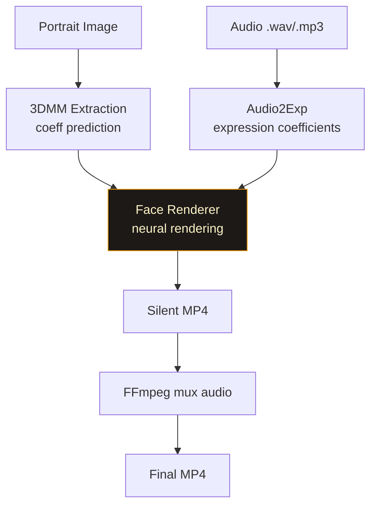

| Property | Detail |
|----------|--------|
| **Technique** | 3D Morphable Model (3DMM) + neural renderer |
| **Input** | Single portrait PNG + audio file |
| **Motion** | Mouth sync + subtle head pose |
| **Model size** | ~4 GB weights |
| **MPS (Apple Silicon)** | ✅ Supported |
| **Repo** | [OpenTalker/SadTalker](https://github.com/OpenTalker/SadTalker) |
| **Best for** | Simple talking head from any photo, well-documented |
| **Limitation** | Head motion less natural than newer models; imageio recursion bug on some envs |

---

#### LivePortrait

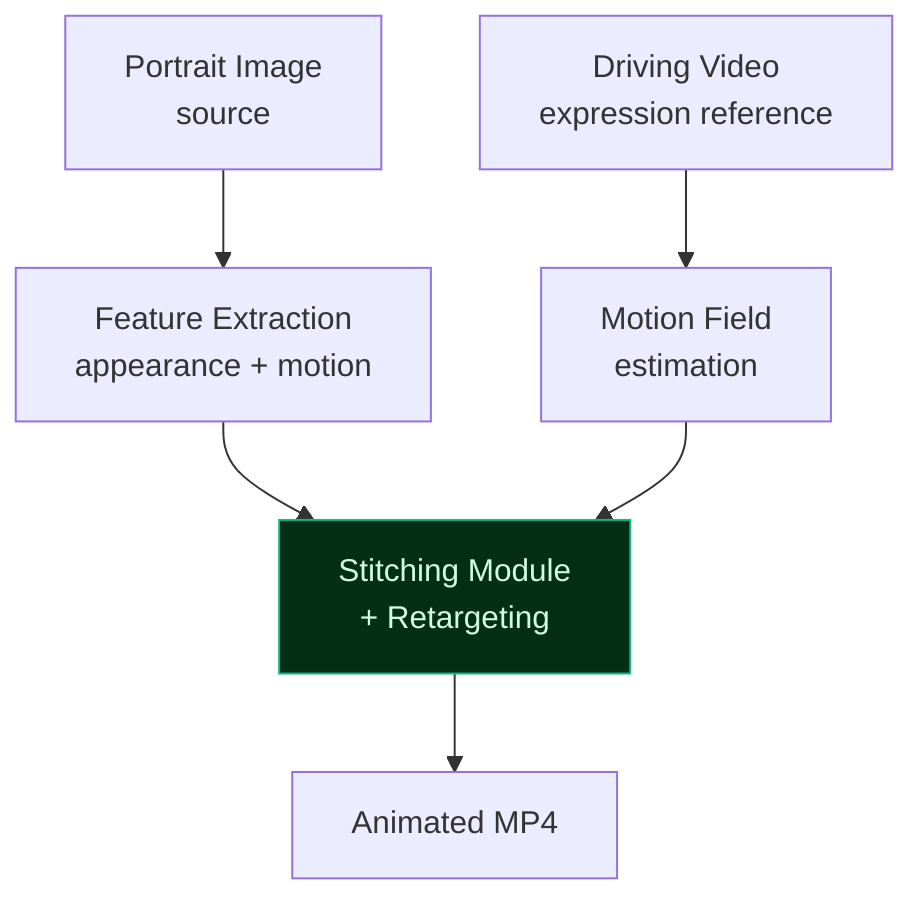

| Property | Detail |
|----------|--------|
| **Technique** | Implicit keypoint + stitching/retargeting |
| **Input** | Portrait image + driving video (expression reference) |
| **Motion** | Full face — eyes, brows, cheeks, mouth, head rotation |
| **Model size** | ~6 GB weights |
| **MPS (Apple Silicon)** | ✅ Supported |
| **Repo** | [KwaiVGI/LivePortrait](https://github.com/KwaiVGI/LivePortrait) |
| **Best for** | Highest quality local animation; realistic expressions |
| **Limitation** | Needs driving video — must pre-record or find a reference |

---

#### Wav2Lip

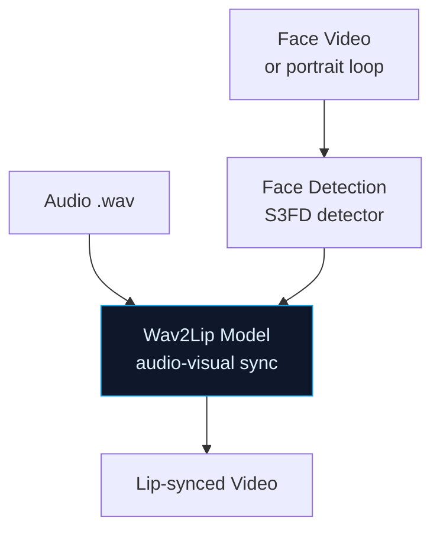

| Property | Detail |
|----------|--------|
| **Technique** | GAN-based audio-visual synchronisation |
| **Input** | Face video (or looped image) + audio |
| **Motion** | Mouth only — rest of face/head unchanged |
| **Model size** | ~300 MB |
| **MPS (Apple Silicon)** | ⚠️ Partial (CPU fallback common) |
| **Repo** | [Rudrabha/Wav2Lip](https://github.com/Rudrabha/Wav2Lip) |
| **Best for** | Lip-syncing an existing video; fastest + smallest model |
| **Limitation** | Lower resolution mouth region; blurry around lips at times |

---

#### MuseTalk

| Property | Detail |
|----------|--------|
| **Technique** | Latent diffusion, audio-conditioned |
| **Input** | Portrait image + audio |
| **Motion** | Mouth + head movement |
| **Model size** | ~8 GB weights |
| **MPS (Apple Silicon)** | ❌ CUDA recommended |
| **Repo** | [TMElyralab/MuseTalk](https://github.com/TMElyralab/MuseTalk) |
| **Best for** | Higher quality than SadTalker; near real-time on good GPU |
| **Limitation** | Heavier GPU requirement; less macOS support |

---

#### VideoReTalking

| Property | Detail |
|----------|--------|
| **Technique** | Sequential editing network |
| **Input** | Face video + audio |
| **Motion** | Mouth only |
| **Model size** | ~1 GB |
| **Best for** | Re-dubbing existing talking-head videos with new audio |
| **Limitation** | Requires a face video, not just a still image |

---

#### GeneFace++

| Property | Detail |
|----------|--------|
| **Technique** | NeRF (Neural Radiance Field) |
| **Input** | 1–2 min training video of the person + audio |
| **Motion** | Full head rotation, natural expressions |
| **Model size** | Trained per-person (~500 MB per identity) |
| **GPU** | CUDA only — no MPS |
| **Best for** | Highest quality personalized avatar with training data |
| **Limitation** | Requires per-identity training (~30 min on A100); CUDA only |

---

#### OmniHuman-1

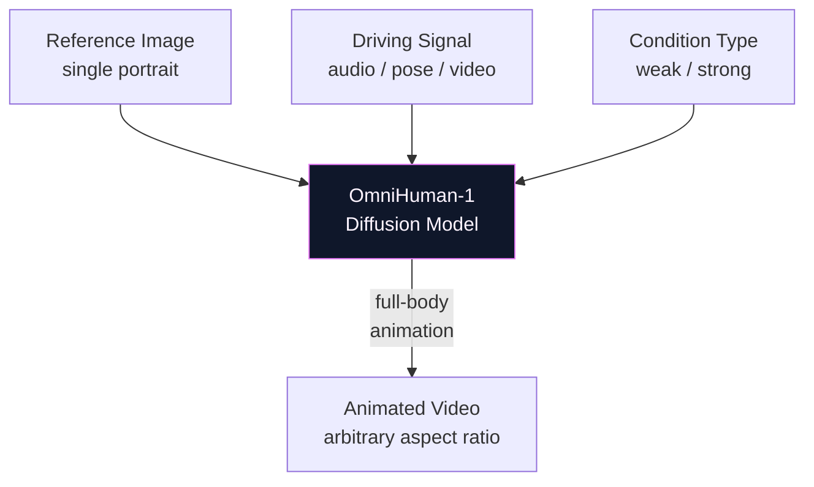

| Property | Detail |
|----------|--------|
| **Technique** | Diffusion-based, omni-conditioned human animation (ByteDance Research) |
| **Input** | Single portrait image + driving signal (audio, body pose, or reference video) |
| **Output** | Full-body animated video — head, torso, arms, hands |
| **Motion** | Full-body motion including natural gestures, not just head/face |
| **Model size** | ~24 GB weights (not yet publicly released) |
| **Aspect ratio** | Arbitrary — portrait (9:16), landscape (16:9), square (1:1) |
| **MPS (Apple Silicon)** | ❌ CUDA only |
| **Availability** | ⚠️ Research preview only — weights not yet public as of 2025 |
| **Repo** | [bytedance/OmniHuman-1](https://github.com/bytedance/OmniHuman-1) (paper + demos only) |
| **Best for** | State-of-the-art full-body animation once weights are released |
| **Limitation** | Not yet publicly usable; requires high-end CUDA GPU; no lip sync fine-tuning |

---

### 3. General Video AI (Not Avatar-Specific)

These generate video from text/image prompts but can produce talking-head style content with the right prompt.

| Platform | Type | Avatar Support | API | Quality | Time | Cost |
|----------|------|----------------|-----|---------|------|------|
| **Runway ML Gen-3** | Text/image → video | ❌ Indirect (prompt-based) | ✅ REST | ⭐⭐⭐⭐⭐ | 30–90s | $0.05/s |
| **Pika Labs** | Text/image → video | ❌ Indirect | ✅ REST | ⭐⭐⭐⭐ | 20–60s | $8/mo |
| **Kling AI** | Text/image → video | ❌ Indirect | ✅ REST | ⭐⭐⭐⭐⭐ | 1–3 min | $10/mo |
| **Luma Dream Machine** | Text/image → video | ❌ Indirect | ✅ REST | ⭐⭐⭐⭐ | 1–2 min | $8/mo |
| **Stable Video Diffusion** | Image → video | ❌ No lip sync | ❌ Local only | ⭐⭐⭐ | 5–15 min local | Free |
| **Sora (OpenAI)** | Text → video | ❌ Indirect | ❌ No API | ⭐⭐⭐⭐⭐ | 2–5 min | $20/mo (ChatGPT Pro) |
| **Wan2.1 (Alibaba)** | Text → video / Image → video | ❌ No lip sync | ✅ Local / HF | ⭐⭐⭐⭐⭐ | 2–5 min (A100) | Free (OSS) |

> ⚠️ General video AI does not synchronise lips to audio — not suitable as a drop-in replacement for a talking-avatar pipeline without additional post-processing.

#### Wan2.1 (Alibaba)

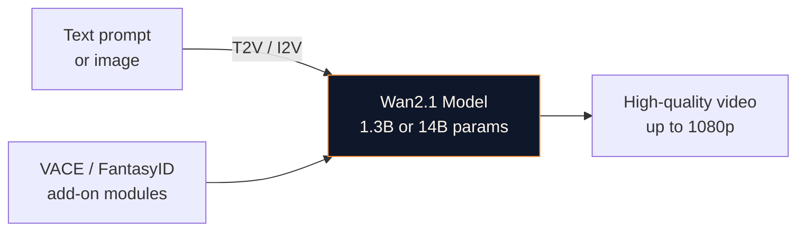

| Property | Detail |
|----------|--------|
| **Technique** | Diffusion Transformer (DiT), open-source |
| **Developer** | Alibaba / Wan Video team |
| **Models** | `Wan2.1-T2V-1.3B`, `Wan2.1-T2V-14B`, `Wan2.1-I2V-14B` |
| **Input** | Text prompt (T2V) or image + prompt (I2V) |
| **Output** | High-quality video clips, up to 1080p |
| **Avatar support** | ❌ No lip sync — indirect via prompt engineering |
| **VACE module** | Video creation + editing add-on; can do pose/motion control |
| **FantasyID module** | Identity-preserving face generation add-on (portrait → video) |
| **GPU RAM** | 1.3B: ~8 GB VRAM · 14B: ~20 GB VRAM |
| **MPS (Apple Silicon)** | ⚠️ Experimental — CUDA recommended for 14B |
| **Repo** | [Wan-Video/Wan2.1](https://github.com/Wan-Video/Wan2.1) |
| **HuggingFace** | `Wan-AI/Wan2.1-T2V-14B` |
| **Best for** | High-quality background scenes, cinematic human video (prompt-driven), pairing with a lip-sync model downstream |
| **Limitation** | No audio conditioning; requires post-processing with Wav2Lip/MuseTalk for lip sync |

---

### 4. SaaS / No-Code Platforms

These are web apps with no programmatic API — useful for manual content creation but cannot be integrated into an automated pipeline.

| Platform | Avatar Types | Voice Clone | Max Video | Free Tier | Price |
|----------|-------------|-------------|-----------|-----------|-------|
| **Wondershare Virbo** | 150+ stock | ✅ | 5 min | ✅ 1 min | $19/mo |
| **Captions.ai** | Photo avatar | ✅ | 10 min | ✅ Limited | $13/mo |
| **Fliki** | Stock + photo | ✅ | Unlimited | ✅ 5 min/mo | $28/mo |
| **InVideo AI** | Stock | ❌ | 15 min | ✅ 4 exports | $25/mo |
| **Steve.ai** | Stock | ❌ | 5 min | ✅ 5 videos | $20/mo |

---

### 5. Full Decision Matrix

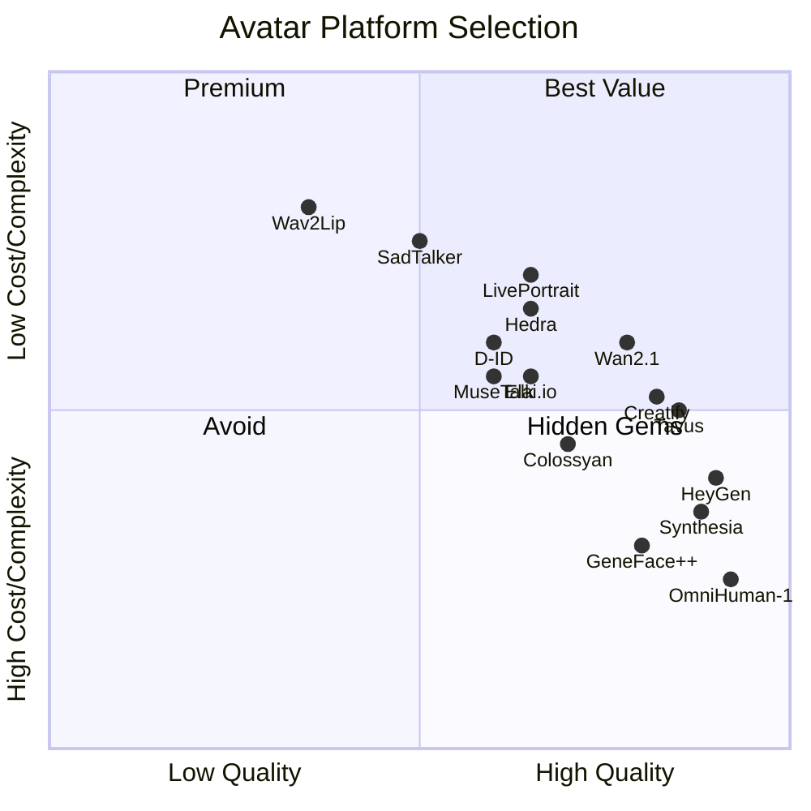

---

### 6. Integration Complexity vs Output Quality

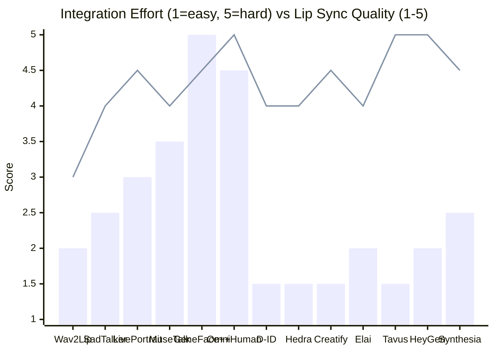

> **Bar = Integration effort** (lower = easier to integrate)
> **Line = Lip sync quality** (higher = better)

---

### 7. Choosing the Right Backend

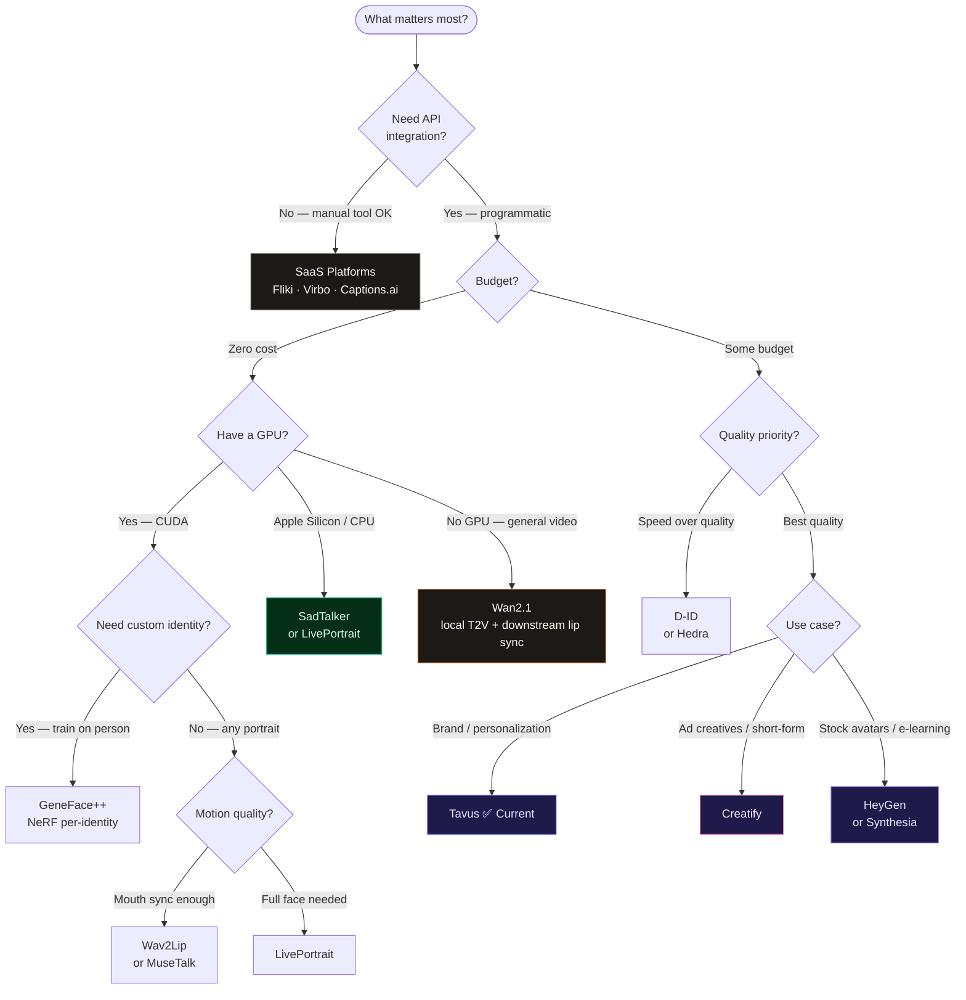

---

### 8. Summary Scorecard

| Platform | Quality | Speed | Cost | API | Custom Avatar | Recommended For |
|----------|---------|-------|------|-----|---------------|-----------------|
| **Tavus** | ⭐⭐⭐⭐⭐ | ⭐⭐⭐ | 💲💲 | ✅ | ✅ Replica | Brand avatars, highest personalization |
| **HeyGen** | ⭐⭐⭐⭐⭐ | ⭐⭐⭐⭐ | 💲💲💲 | ✅ | ✅ Instant | Marketing, best overall quality |
| **Synthesia** | ⭐⭐⭐⭐⭐ | ⭐⭐⭐ | 💲💲💲 | ✅ Enterprise | ✅ Personal | Enterprise e-learning |
| **D-ID** | ⭐⭐⭐⭐ | ⭐⭐⭐⭐ | 💲 | ✅ | ✅ Photo | Fast prototyping, budget |
| **Hedra** | ⭐⭐⭐⭐ | ⭐⭐⭐⭐ | 💲 | ✅ Beta | ✅ Photo | Custom voice + photo |
| **Elai.io** | ⭐⭐⭐⭐ | ⭐⭐⭐ | 💲💲 | ✅ | ✅ Photo | Mid-market, good API |
| **LivePortrait** | ⭐⭐⭐⭐⭐ | ⭐⭐⭐ | Free | ✅ Local | ✅ Any photo | Local, best OSS quality |
| **SadTalker** | ⭐⭐⭐⭐ | ⭐⭐⭐ | Free | ✅ Local | ✅ Any photo | Local, easiest OSS setup |
| **MuseTalk** | ⭐⭐⭐⭐ | ⭐⭐⭐⭐ | Free | ✅ Local | ✅ Any photo | Local + near real-time (CUDA) |
| **Wav2Lip** | ⭐⭐⭐ | ⭐⭐⭐⭐⭐ | Free | ✅ Local | ✅ Any photo | Lightest model, re-dubbing |
| **GeneFace++** | ⭐⭐⭐⭐⭐ | ⭐⭐ | Free | ✅ Local | ✅ Trained | Highest local quality with training |
| **Creatify** | ⭐⭐⭐⭐⭐ | ⭐⭐⭐⭐ | 💲💲 | ✅ | ✅ Digital Twin | Ad creatives, short-form social content |
| **OmniHuman-1** | ⭐⭐⭐⭐⭐ | ⭐⭐ | Free (OSS) | ⚠️ Not yet | ✅ Any photo | Full-body animation — research preview only |
| **Wan2.1** | ⭐⭐⭐⭐⭐ | ⭐⭐⭐ | Free (OSS) | ✅ Local/HF | ❌ No lip sync | High-quality T2V/I2V; combine with lip-sync model |
| **Runway Gen-3** | ⭐⭐⭐⭐⭐ | ⭐⭐⭐⭐ | 💲💲 | ✅ | ❌ No lip sync | Creative/cinematic, not avatar-specific |

---

## Tech Stack

| Layer | Technology |
|-------|-----------|
| Frontend | Vite + React + Tailwind CSS |
| Backend | Koa (Node.js) + TypeScript |
| Script AI | Google Gemini 2.5 Flash |
| Lip-sync | **Tavus API** (current) / SadTalker / LivePortrait |
| Transcription | Groq Whisper large-v3 |
| Video processing | FFmpeg + fluent-ffmpeg |
| Captions | ASS subtitles (viral / professional / creator) |

## Environment Variables

```env
GEMINI_API_KEY=          # Google AI Studio
TAVUS_API_KEY=           # Tavus (if using Tavus backend)
TAVUS_REPLICA_ID_AVATAR1=  # phoenix-4 replica for Sophia
TAVUS_REPLICA_ID_AVATAR2=  # phoenix-4 replica for James
TAVUS_REPLICA_ID_AVATAR3=  # phoenix-4 replica for Mia
TAVUS_REPLICA_ID_AVATAR4=  # phoenix-4 replica for Alex
GROQ_API_KEY=            # Groq (Whisper transcription)
```

## Quick Start

```bash
npm install
cp .env.example .env   # fill in your API keys
npm run dev
```
