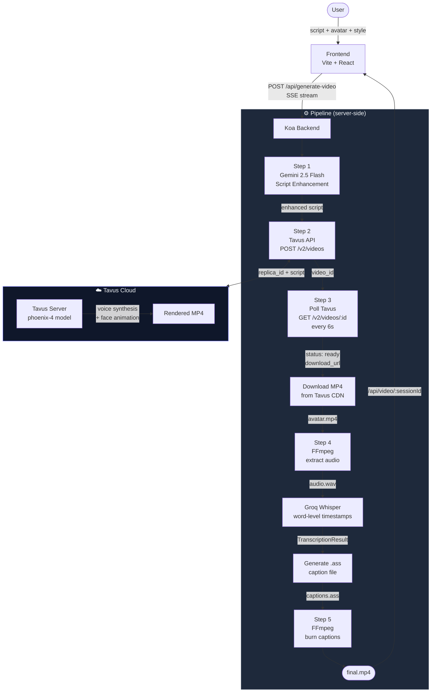
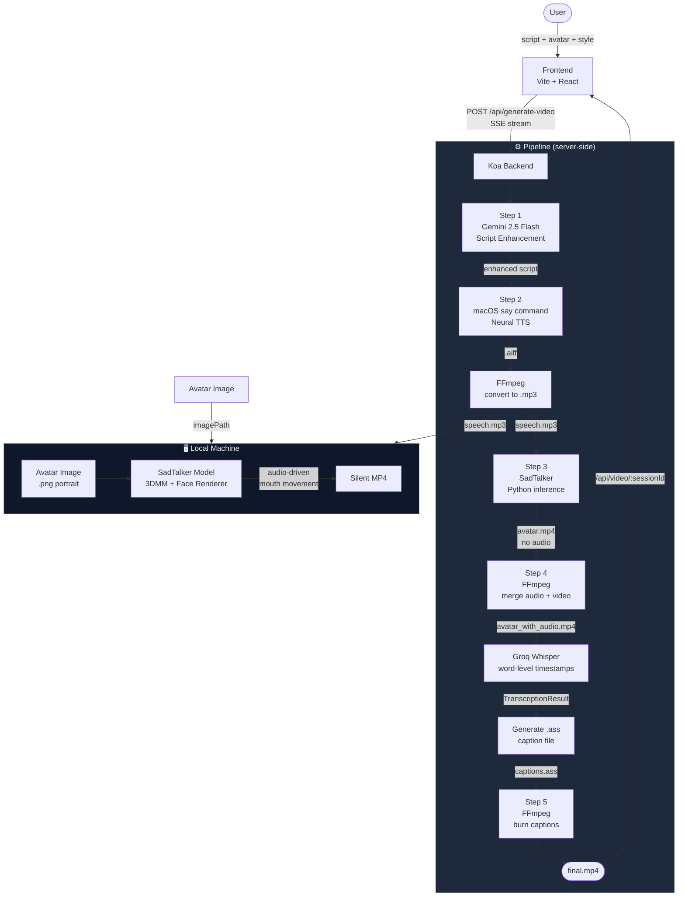
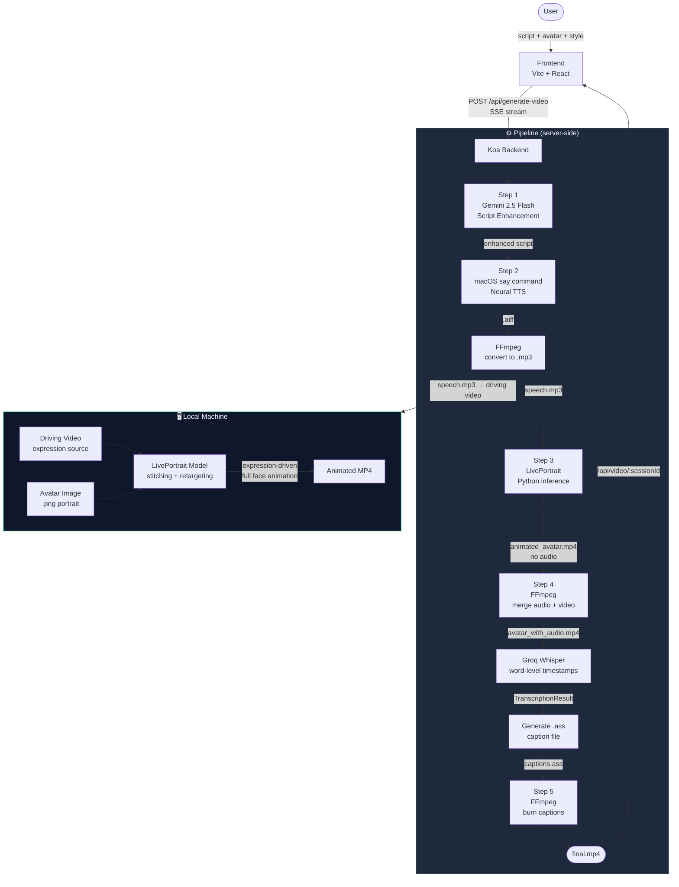
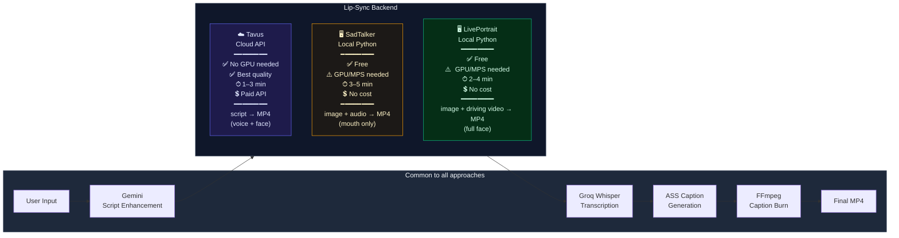

# SubMagic Avatar POC

AI-powered talking avatar video generator. Enter a script, pick an avatar and caption style — the pipeline produces a lip-synced, captioned MP4 in minutes.

---

## System Architecture

The pipeline supports three interchangeable **lip-sync backends**. Everything else (script enhancement, transcription, captions, final render) stays the same.

---

## Architecture 1 — Tavus (Cloud API) ✅ Current



### Tavus Data Flow

| Step | Service | Input | Output | Time |
|------|---------|-------|--------|------|
| 1 | Gemini 2.5 Flash | Raw script + emotion | Enhanced script | ~2s |
| 2–3 | Tavus API | Replica ID + script | Talking head MP4 | ~1–3 min |
| 4 | FFmpeg + Groq Whisper | MP4 | Word timestamps | ~10s |
| 5 | FFmpeg | Video + .ass | Captioned MP4 | ~15s |

**Tavus handles both voice synthesis and face animation in one API call.** No local GPU required.

---

## Architecture 2 — SadTalker (Local, Free)



### SadTalker Data Flow

| Step | Service | Input | Output | Time |
|------|---------|-------|--------|------|
| 1 | Gemini 2.5 Flash | Raw script + emotion | Enhanced script | ~2s |
| 2 | macOS TTS (`say`) + FFmpeg | Script text | speech.mp3 | ~3s |
| 3 | SadTalker (Python/MPS) | Portrait image + audio | Silent MP4 | ~3–5 min |
| 4 | FFmpeg mux | MP4 + MP3 | MP4 with audio | ~2s |
| 5 | FFmpeg + Groq Whisper | MP4 | Word timestamps | ~10s |
| 6 | FFmpeg | Video + .ass | Captioned MP4 | ~15s |

**Runs entirely on-device.** No API costs — requires local Python venv + model weights (~4 GB).

---

## Architecture 3 — LivePortrait (Local, Free)



### LivePortrait Data Flow

| Step | Service | Input | Output | Time |
|------|---------|-------|--------|------|
| 1 | Gemini 2.5 Flash | Raw script + emotion | Enhanced script | ~2s |
| 2 | macOS TTS + FFmpeg | Script text | speech.mp3 | ~3s |
| 3 | LivePortrait (Python/MPS) | Portrait image + driving video | Animated MP4 | ~2–4 min |
| 4 | FFmpeg mux | MP4 + MP3 | MP4 with audio | ~2s |
| 5 | FFmpeg + Groq Whisper | MP4 | Word timestamps | ~10s |
| 6 | FFmpeg | Video + .ass | Captioned MP4 | ~15s |

**More natural head motion than SadTalker** (full face stitching), but requires a reference driving video for expressions.

---

## Side-by-Side Comparison



---

## Tech Stack

| Layer | Technology |
|-------|-----------|
| Frontend | Vite + React + Tailwind CSS |
| Backend | Koa (Node.js) + TypeScript |
| Script AI | Google Gemini 2.5 Flash |
| Lip-sync | **Tavus API** (current) / SadTalker / LivePortrait |
| Transcription | Groq Whisper large-v3 |
| Video processing | FFmpeg + fluent-ffmpeg |
| Captions | ASS subtitles (viral / professional / creator) |

## Environment Variables

```env
GEMINI_API_KEY=          # Google AI Studio
TAVUS_API_KEY=           # Tavus (if using Tavus backend)
TAVUS_REPLICA_ID_AVATAR1=  # phoenix-4 replica for Sophia
TAVUS_REPLICA_ID_AVATAR2=  # phoenix-4 replica for James
TAVUS_REPLICA_ID_AVATAR3=  # phoenix-4 replica for Mia
TAVUS_REPLICA_ID_AVATAR4=  # phoenix-4 replica for Alex
GROQ_API_KEY=            # Groq (Whisper transcription)
```

## Quick Start

```bash
npm install
cp .env.example .env   # fill in your API keys
npm run dev
```
